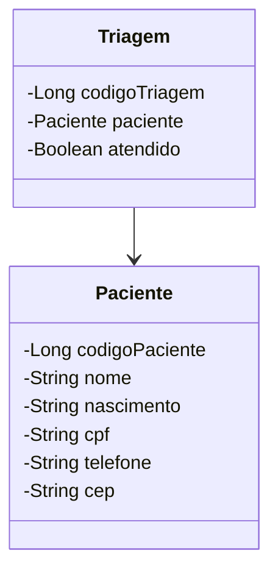

## Sistema de Consulta de Triagem Hospitalar

### Tecnologias usadas:
- Java 21 com Spring Boot
- Spring Web, Data MongoDB e RabbitMQ
- Docker para serviços do MongoDB e RabbitMQ

Utilizando uma fila para novas triagens, um microserviço escuta uma fila e realiza operações através de uma API que se comunicará com um banco de dados. 
O microserviço permite requisições a respeito das triagens, além de informar a quantidade de pacientes que não foram atendidos.

### Iniciar aplicação
Dentro da pasta <b>/local</b> executar "docker compose up" para baixar e iniciar os serviços configurados no arquivo <i>docker-compose.yml</i>.

RabbitMQ configurado em <i>localhost:15672</i> com user e password <b>'guest'</b>.

### Fluxo do sistema
</img>

<br/>

### JSON a ser recebido pelo RabbitMQ
```
{
	"paciente": {
			"nome": "Luiz Fernando Quinholi",
			"nascimento": "21-12-2004",
			"cpf": "12345678901",
			"telefone": "44912345678",
			"cep": "83838383"
			},
	"atendido": false
}
```

<br/>

### Diagramação Mermaid



<br/>

### Endpoints

 

 <!-- GET All <br/>
 

 GET One <br/>
  -->
